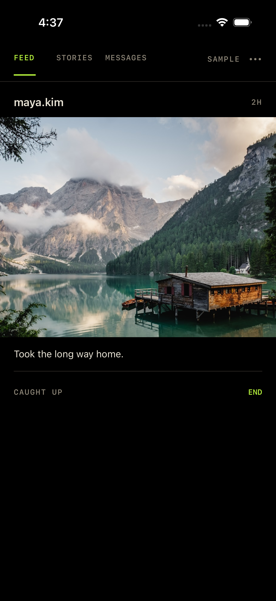
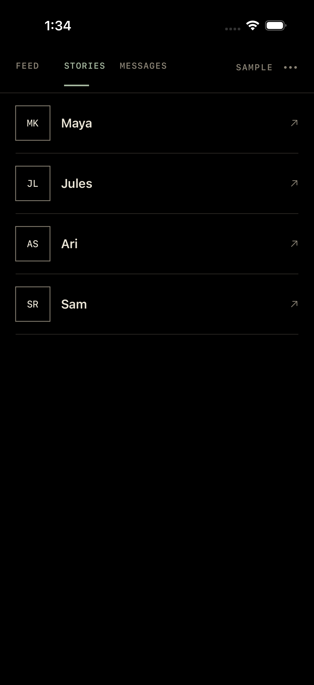
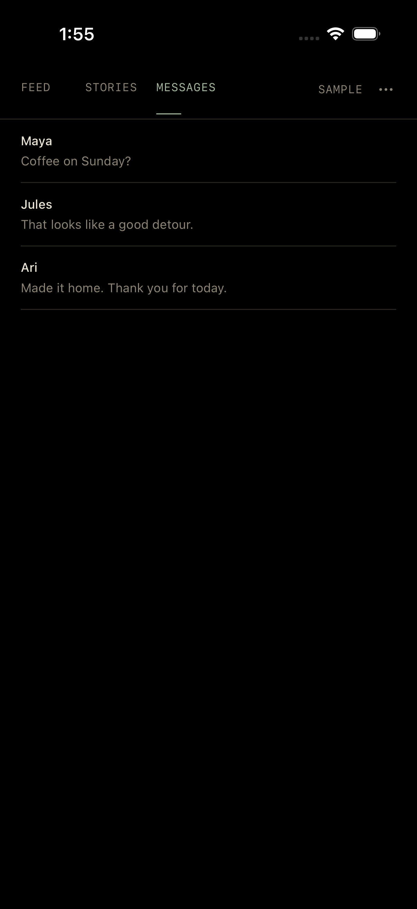
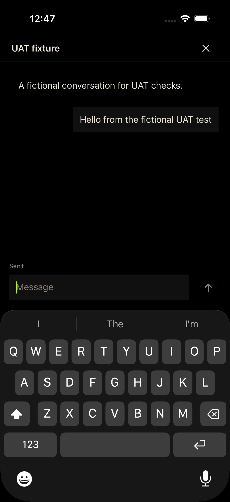

# Porch

A quiet, free, open-source Instagram client for iOS. Native views, a black canvas, and three separate places: **Feed · Stories · Messages**.

There is no subscription, Porch account, backend, advertising, or app analytics.

<p>
  
  
  
  
</p>

Screenshots use fictional sample content. Signed-in verification is recorded separately in [VERIFICATION.md](VERIFICATION.md).

## UAT build

- Native Following posts and carousels. Recognized ads, paid partnerships, Reels and recommendation modules are excluded before rendering. Authors must be positively identified as followed.
- **Stories are separate from the feed.** Select a person, advance their stories yourself, then close. No timer or automatic transition to another person.
- Videos have an explicit Play control. No autoplay.
- Read accepted conversations, load earlier messages and send text from a native composer. Sending requires an acknowledgement; uncertain sends stay visibly unresolved and cannot retry automatically. Non-text attachments have descriptive placeholders. No message requests, likes, follows or posting.
- Posts, older conversations and earlier messages load only when requested. Pull to refresh or use Settings → Reload. Failed refreshes preserve loaded content. Each session holds at most 200 posts/conversations/messages per relevant view.
- Sign in through Instagram's own page. End a session to close content; Clear sign-in removes the local website data and shared media-response cache.
- A fully offline sample needs no Instagram account.

This is an **experimental source release**. Native playback progression is verified in the simulator with both a local fixture and a real Instagram video. Live DM delivery and physical-device acceptance still require verification before friend UAT. Instagram's unofficial data routes can change or reject requests. Following means accounts you follow, not necessarily personal friends. Unknown content can be omitted; the adapter does not guarantee complete coverage. It does not block the separate Instagram app. There is no App Store release.

## How it works

Instagram's website is used only for sign-in. For reading, a separate, empty local WebKit document makes authenticated GET requests using the existing on-device cookie store. A small bundled adapter reduces responses to bounded models; SwiftUI renders them. No Instagram application HTML, application scripts, or live DOM-pruning loop is loaded for reading.

Credentials stay in WebKit. Post and message content crosses into native memory; nothing is sent to a Porch server. Instagram and its media servers still see requests. See [PRIVACY.md](PRIVACY.md) and [DESIGN.md](DESIGN.md).

## Build

Requires macOS, Xcode and [XcodeGen](https://github.com/yonaskolb/XcodeGen). Deployment target: iOS 18. Verified toolchain and limitations: [VERIFICATION.md](VERIFICATION.md).

```sh
brew install xcodegen
xcodegen generate
open Porch.xcodeproj
```

Select the Porch scheme and an iPhone simulator, then Run. Simulator builds need no signing identity. For a physical phone, select your own development team in Xcode.

```sh
xcodebuild -project Porch.xcodeproj -scheme Porch \
  -destination 'platform=iOS Simulator,name=iPhone 17 Pro' test
```

The default suite uses fictional fixtures and a nonpersistent WebKit store. `PorchLiveCheck` is an opt-in signed-out login-page check. `PorchAccountCheck` is an opt-in read-only integration check that requires an existing signed-in account with a Following post and an active story. It retains private screenshots in the local Xcode result bundle; never publish those results.

## Preparing the UAT build

Run `bash tools/build-uat.sh` to produce an unsigned **Release** archive at `.build-uat/Porch.xcarchive`. Signing and installation use the operator's existing distribution workflow. Debug fixture transport is excluded from Release. No TestFlight or App Store submission is made by this script.

The [UAT guide](docs/UAT.md) describes the checks and remaining acceptance gates. Settings → Share diagnostic details includes version and request status without account content. CI runs only offline fixtures and a device Release compilation; live account checks are opt-in.

## Project commitment

Porch will remain free, with no subscription or paid features. Contributions should preserve deliberate use: no streaks, guilt counters, engagement prompts or attention auctions. The code is [MPL-2.0](LICENSE); that license permits commercial forks, so the no-subscription commitment is our project policy, not a restriction on other people. Asset licensing is recorded in [THIRD_PARTY_NOTICES.md](THIRD_PARTY_NOTICES.md).

Porch is independent of Instagram, Meta and the products that inspired it.
